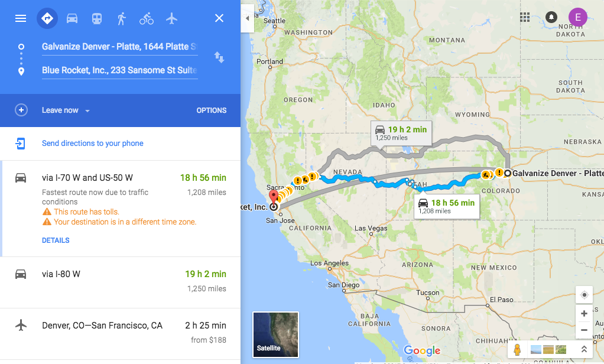
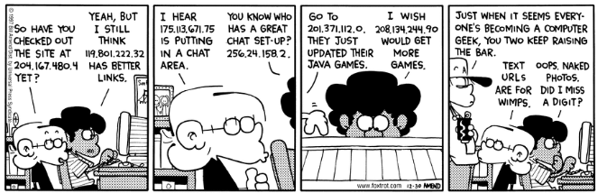
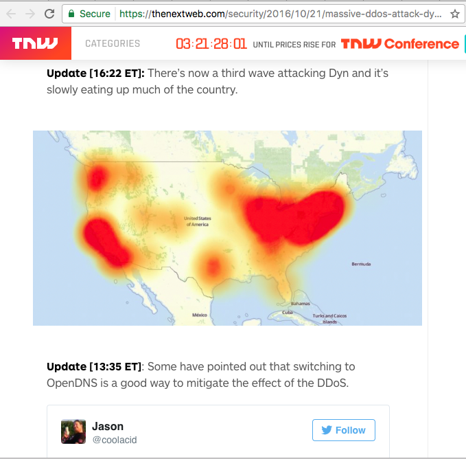
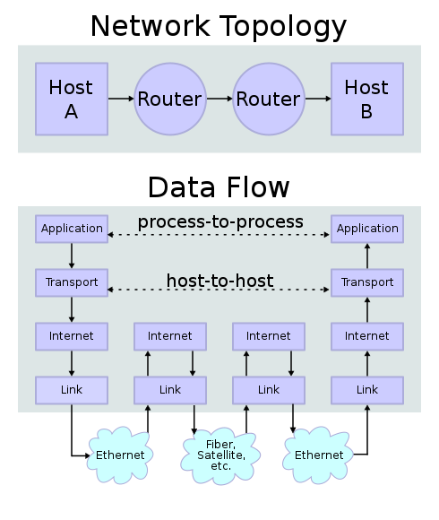

# Networking Training

## Fundamentals

One way to visualize the Internet is to think about a physical map brought to life - people are inside rooms in buildings, and small roads connect these buildings. Zooming out, we see neighborhoods, and cities, and larger roads connecting these cities. Zooming back in, we see security guards who protect traffic into and out of some of the buildings, and other buildings that anyone can go into and out of. We see people using a common language to communicate with each other, and we see different people with different jobs zipping around to do different things.

Before the invention of GPS, how would a person have moved from point A to point B on this map? Let's imagine this with a specific scenario:

    Evan is at work at Galvanize in Denver, CO, and needs to drive to Blue Rocket
    in San Francisco, CA to deliver a training on Internet Networking.

How would Evan do this, before he had an iPhone that told him what to do?

1. Evan doesn't know the address of Galvanize by heart. Fortunately, he has a phone book from San Francisco - he flips through the phone book and finds out that Galvanize is located at 233 Sansome St Suite 1100, San Francisco, CA
2. Evan parked his car in the parking garage downstairs, so he walks down to his car and drives to the exit of the garage
3. At the garage exit, he asks the attendant about the best way to get to San Francisco. The parking attendant says "Well, I'm not an all-seeing oracle, but I know that you need to get on I-70 and west go from there. The best way to get there from here is to go South on Federal, take 6 West, and merge onto I-70. I know you'll need to go at least as far as Green River, Utah."
4. Evan follows these helpful instructions, and drives west through the Rocky mountains, arriving in Green River that evening. There, he pulls in to a gas station to refill his car, and asks the cashier about the best way to get to San Francisco. The cashier tells him that he'd normally recommend taking Route 50 to Reno, but he knows there happens to be construction going on, so the best way is probably to take 191 up to Salt Lake City, and then catch I-80 over to Reno.
5. Evan gets to Reno, and another helpful gas station attendant tells him that he can safely follow I-80 all the way to San Francisco from there.
6. Evan drives over the Bay Bridge into SF and manages to find the Philz Coffee shop on Market. There, the barista tells him he can get to 233 Sansome St by following Market St to Pine St, and then taking a right on Sansome.
7. At 233 Sansome, Evan is greeted by a friendly security guard. Access to the building is protected, but fortunately Evan has printed out a letter from David that gives him secure access to Suite 1100, so the guard waives him through
8. Evan rides the elevator up to the 11th floor, and arrives at his destination!

Woo hoo!! 🙌

Looking at this example, there are a number of metaphors that can help us understand how Internet networking works:

* A **DNS Server** is kind of like a phone book. It maps a **domain name** (google.com) to an actual **IP address** (172.217.5.110) on a physical **host**.
* A **private network** is kind of like the inside of a building, allowing a specific set of IP addresses to be reused. In our real world example, there could be a lot of parking garages, but Evan only needs to know how to get to the parking garage in his building.
* In a **public network** on the other hand, every IP address needs to be unique, just as Evan needed to know that he'd get to Blue Rocket if he travelled to 233 Sansome St in San Francisco.
* A **gateway** is the interface between two networks (often times, between a private network and a public network) - if you need to go somewhere outside of your network, you go to the gateway and get directions from there.
* A **router** joins different networks together, and is capable of routing traffic the most efficient way (just as the helpful gas station attendant diverted Evan up to Salt Lake City).
* A **firewall** can be set up to protect a private network, allowing only certain authorized traffic through (just as the security guard could have prevented Evan from travelling to the 11th floor)
* A **port** can be set up as an interface on a host machine to allow certain types of communication - just as Evan could only give his training for Blue Rocket on the 11th floor of 233 Sansome St.

## Examples

Let's look at these networking fundamentals with some specific examples.

If you're on a Mac, you can inspect your network configuration with the `ifconfig` command:

    $ ifconfig
    ...
    ether 2c:f0:ee:1d:66:be
    inet6 fe80::141d:5a0f:fb91:2498%en0 prefixlen 64 secured scopeid 0x4
    inet 10.6.16.139 netmask 0xfffff000 broadcast 10.6.31.255
    nd6 options=201<PERFORMNUD,DAD>
    media: autoselect
    status: active
    ...

There are a few important pieces of information here. First, I can see that my *IP address* is *10.6.16.139*. From experience, I know that IP addresses starting with _10_ are [reserved for private networks](https://en.wikipedia.org/wiki/Private_network), so I know that I am on a private, not a public, network:

**Private IPv4 address space:**
<table>
    <tr>
        <td>IP Address Range</td>
        <td>Number of addresses</td>
        <td>Largest CIDR block</td>
    </tr>
    <tr>
      <td>10.0.0.0 – 10.255.255.255</td>
      <td>16,777,216</td>
      <td>10.0.0.0/8 (255.0.0.0)</td>
    </tr>
    <tr>
      <td>172.16.0.0 – 172.31.255.255</td>
      <td>1,048,576</td>
      <td>172.16.0.0/12 (255.240.0.0)</td>
    </tr>
    <tr>
      <td>192.168.0.0 – 192.168.255.255</td>
      <td>65,536</td>
      <td>192.168.0.0/16 (255.255.0.0)</td>
    </tr>
</table>

This table also helps us understand some important concepts in Internet networks, so let's dive in a bit deeper.

### IPv4 addresses

IPv4 addresses are denoted by four sets of three digits, such as my IP address above:

    10.6.16.139

These addresses _actually_ represent a 32-bit number, with each of the four segments representing an 8-bit block. There are a little over 4 billion possible combinations:

    2 ^ 32 = 4,294,967,296

That's a lot of possible IP addresses, but it's easy to see how we could quickly run out with all of the devices that are on the Internet these days. One (of many) reason we have private networks is to allow some of these IP addresses to be recycled. So *anyone* in the world could create a private network in the range *10.0.0.0 - 10.255.255.255*, but only one computer on that network could have my IP address

Even with that, you can see we'd run out of IP addresses pretty quickly. A newer standard called **IPv6** has been set up with a much larger range of addresses, but most networks still support IPv4 and it's a bit easier to understand so we'll stick with that for now.

### Subnet masks

Subnet masks help define the size of a network. The larger the mask, the more addresses are _not_ part of the network. Subnet masks can be denoted in terms of _bits_ (eg, 12), a _netmask_ (eg, 255.240.0.0), or a _CIDR_ mask:

<table>
    <tr>
        <td>Mask size (bits)</td>
        <td>Netmask</td>
        <td>CIDR</td>
        <td>Number of addresses</td>
    <tr>
    <tr>
        <td>31</td>
        <td>255.255.255.252</td>
        <td>FFFFFFFF</td>
        <td>4</td>
    <tr>
    <tr>
        <td>24</td>
        <td>255.255.255.0</td>
        <td>FFFFFF00</td>
        <td>256</td>
    <tr>
    <tr>
        <td>20</td>
        <td>255.255.240.0</td>
        <td>FFFFF000</td>
        <td>4,096</td>
    <tr>
</table>

Within a given subnet mask, any computer on the network defined by that subnet can reach every other computer on that network directly, without needing to travel across the network boundary. This is one reason that you're more vulnerable to a hacker sitting at the same coffee shop as you, than one who is sitting in another part of the world on a different network.

Looking at my output from `ifconfig` again:

    $ ifconfig
    ...
    ether 2c:f0:ee:1d:66:be
    inet6 fe80::141d:5a0f:fb91:2498%en0 prefixlen 64 secured scopeid 0x4
    inet 10.6.16.139 netmask 0xfffff000 broadcast 10.6.31.255
    nd6 options=201<PERFORMNUD,DAD>
    media: autoselect
    status: active
    ...

... I can see that my network has a subnet mask of `fffff000`, which means it could host a total of 4,096 devices.

### Gateways

Gateways play a special role within networks, and outside of them (remember our parking lot attendant who helped Evan find out where to go after leaving Galvanize).

On a Mac, you can look up your gateway with the `route default` command:

    $ route get default
    route to: default
    destination: default
    mask: default
    gateway: 10.6.16.1
    interface: en0

You can test your connection to the gateway with the `ping` command (`ping` is a really useful utility for checking the connection to any DNS address or IP address):

    $ ping 10.6.16.1
    PING 10.6.16.1 (10.6.16.1): 56 data bytes
    64 bytes from 10.6.16.1: icmp_seq=0 ttl=64 time=18.024 ms
    64 bytes from 10.6.16.1: icmp_seq=1 ttl=64 time=4.295 ms
    64 bytes from 10.6.16.1: icmp_seq=2 ttl=64 time=2.978 ms
    64 bytes from 10.6.16.1: icmp_seq=3 ttl=64 time=1.812 ms
    64 bytes from 10.6.16.1: icmp_seq=4 ttl=64 time=2.952 ms
    ^C
    --- 10.6.16.1 ping statistics ---
    5 packets transmitted, 5 packets received, 0.0% packet loss
    round-trip min/avg/max/stddev = 1.812/6.012/18.024/6.057 ms

I can see that my computer has a stable, fast connection to the gateway (the fact that the time is only ~4ms is pretty fast).

On any given local network, the gateway is usually the _router_, which will also assign IP addresses and defaults for DNS servers. Sometimes, virtual networks will be set up _inside_ a given computer - in that case the computer's network interface will act as the gateway. In my case, I have a private network set up that allows _Virtualbox_ to run virtual machines:

    $ ifconfig
    ...
    vboxnet0: flags=8943<UP,BROADCAST,RUNNING,PROMISC,SIMPLEX,MULTICAST> mtu 1500
	  ether 0a:00:27:00:00:00
	  inet 192.168.99.1 netmask 0xffffff00 broadcast 192.168.99.255

We'll come back to that in a bit!

### Domain Names

Before our eyes glaze over any further with all of these permutations of powers of 2, what does this have to do with the Internet browsing I'm familiar with?

Because words are much easier to remember than numbers, we usually use _domain names_ to refer to them. A group of public _Domain Name Server (DNS)_ providers are responsible for registering domain names and mapping them to IP addresses. So if you ever need to visit *google.com*, the first thing your computer will do will look up the IP address using its DNS server (side note: often, routers will assign DNS servers by default, but you can always override this setting if you have a DNS server you know that works).

On a Mac, the `nslookup` command can be used to find out the IP address for a given domain name:

    $ nslookup google.com
    Server:		208.67.222.222
    Address:	208.67.222.222#53

    Non-authoritative answer:
    Name:	google.com
    Address: 172.217.5.110
    Name:	google.com
    Address: 172.217.5.110
    Name:	google.com
    Address: 172.217.5.110

The output above tells me a few things. First, I can see that I am currently using a DNS server at _208.67.222.222_. Second, I can see that the public IP address for google.com is _172.217.5.110_.

What happens if I can't reach the DNS server, you may be asking? From a networking perspective, this is a bad thing. You may remember the recent DDOS attack when a bunch of bots on IoT outages attacked Dyn, a major DNS provider, and it wiped out traffic across a good chunk of the US:

### Routers

We've already talked about routers a bit, but they play a big role on the Internet, linking traffic across networks, and helping to divert traffic to alternate routes when specific routes are overloaded. To go back to our metaphor, Evan passed through a few 'routers' on his way to San Francisco - at Galvanize, at Green River, at Reno, and at Philz. Each time, he asked the 'router' for directions about where to go next, and the router told him, based on an analysis of the routes available, and the likely speed at which he could travel along that route.

On a Mac, you can use the command `traceroute` to visualize the route your traffic takes to a given domain - each row below is a router that facilitated one segment of the request:

    $ traceroute google.com
    traceroute to google.com (172.217.5.110), 64 hops max, 52 byte packets
     1  xe-5-2-1.mpr1.den1.us.zip.zayo.com (128.177.113.101)  4.016 ms  3.418 ms  2.734 ms
     2  ae26.cs1.den5.us.eth.zayo.com (64.125.31.240)  22.302 ms  23.062 ms  24.606 ms
     3  ae5.cs1.ord2.us.eth.zayo.com (64.125.29.18)  24.074 ms  21.603 ms  23.014 ms
     4  ae27.cr1.ord2.us.zip.zayo.com (64.125.30.243)  23.151 ms  25.003 ms  22.415 ms
     5  ae15.er1.ord7.us.zip.zayo.com (64.125.31.85)  22.558 ms  23.150 ms  21.793 ms
     6  72.14.217.53 (72.14.217.53)  23.478 ms  23.579 ms  21.882 ms
     7  108.170.244.19 (108.170.244.19)  25.248 ms
        108.170.243.243 (108.170.243.243)  23.295 ms
        108.170.244.19 (108.170.244.19)  22.412 ms
     8  209.85.241.47 (209.85.241.47)  25.023 ms
        209.85.251.241 (209.85.251.241)  23.951 ms
        209.85.243.163 (209.85.243.163)  23.627 ms
     9  209.85.247.5 (209.85.247.5)  33.874 ms  33.870 ms  33.561 ms
    10  216.239.47.250 (216.239.47.250)  43.123 ms  42.668 ms  45.072 ms
    11  209.85.248.126 (209.85.248.126)  49.776 ms  50.518 ms
        72.14.239.62 (72.14.239.62)  52.650 ms
    12  209.85.246.21 (209.85.246.21)  50.322 ms
        209.85.249.62 (209.85.249.62)  52.077 ms
        209.85.246.39 (209.85.246.39)  50.418 ms
    13  108.170.243.1 (108.170.243.1)  51.054 ms
        108.170.242.225 (108.170.242.225)  50.257 ms
        108.170.243.1 (108.170.243.1)  50.860 ms
    14  108.170.236.61 (108.170.236.61)  51.374 ms
        108.170.236.63 (108.170.236.63)  51.541 ms  51.809 ms
    15  sfo03s07-in-f110.1e100.net (172.217.5.110)  52.007 ms  51.967 ms  51.424 ms

Notice how the very last IP address on the list matches the IP address we got from our DNS server!

### Firewalls and Ports

Another reason we have private networks is because the public Internet is a pretty scary place, where lots of good stuff can happen but lots of dangerous characters hang out as well.

Most networks are protected by a _Firewall_ that can limit traffic based on IP address, _port number_, or other rules. Think of a port number as a way for a computer (on an IP address) to further sub-divide traffic, so that different services running on that server can receive specific types of traffic. A few of the most well-known, standardized port numbers are:

<table>
  <tr>
    <td>Port number</td>
    <td>Description</td>
  </tr>
  <tr>
    <td>21</td>
    <td>File Transfer Protocol (FTP) data transfer</td>
  </tr>
  <tr>
    <td>22</td>
    <td>Secure Shell (SSH)</td>
  </tr>
  <tr>
    <td>80</td>
    <td>Hypertext Transfer Protocol (HTTP)</td>
  </tr>
  <tr>
    <td>443</td>
    <td>Hypertext Transfer Protocol over TLS/SSL (HTTPS)</td>
  </tr>
</table>

Some port numbers are commonly used for specific applications (8080 is often used by the Apache Tomcat web server, and has become a common port to use for other types of web servers as well).

As noted above, firewalls can be configured to block traffic on certain port numbers, or limit it to specific IP addresses. For example, the engineers maintaining the big, bad routers at Google might allow traffic from anywhere on port 80 and 443 (the default HTTP and HTTPS ports), but limit traffic on port 22 (the SSH port) to a set of secure IP addresses.

## Advanced Topics

### TCP/IP

The [TCP/IP Protocol](https://en.wikipedia.org/wiki/Internet_protocol_suite) is a common name for the *Internet protocol suite*, which underlies all of the things we've talked about above. The TCP/IP protocol is abstracted into four layers that help route traffic:

<table>
  <tr>
    <td>Layer</td>
    <td>Role</td>
  </tr>
  <tr>
    <td>Application Layer</td>
    <td>Used to communicate user data between services running on the same, or different, hosts. This is the layer at which higher-level protocols such as HTTP and SSH operate.</td>
  </tr>
  <tr>
    <td>Transport Layer</td>
    <td>Used for host-to-host communication, facilitated by routers and network interfaces. UDP is the basic protocol, while TCP provides more reliable transport.</td>
  </tr>
  <tr>
    <td>Internet Layer</td>
    <td>Used to exchange data across network boundaries. The IP address protocol is defined at this level.</td>
  </tr>
  <tr>
    <td>Link Layer</td>
    <td>Defines networking methods within local networks, allowing hosts to communicate without intervening routers.</td>
  </tr>
</table>

### HTTP(S) protocol

HTTP (or, the Hypertext Transfer Protocol) is super fun and powers a lot of the Internet that we know and love. Some fun facts:

* An *HTTP session* encapsulates request from a client to a server, and that server's response.
* Requests can be defined with various *methods* (GET, PUT, POST) that define whether the client is trying to retrieve, update or otherwise modify the resource.
* Some requests, such as POST and PUT, may include a *body* of information that the client wants to send to the server.
* Requests usually have *headers* that tell the server something about the host, and what it might expect back.
* The server will respond with a *status code* that defines whether or not the request was successful, as well as response headers, and sometimes a response body.

A variety of methods can be used to make an HTTP request. One command you may have seen before is `curl`:

    curl -v -X GET http://google.com
    Note: Unnecessary use of -X or --request, GET is already inferred.
    * Rebuilt URL to: http://google.com/
    *   Trying 172.217.5.110...
    * TCP_NODELAY set
    * Connected to google.com (172.217.5.110) port 80 (#0)
    > GET / HTTP/1.1
    > Host: google.com
    > User-Agent: curl/7.51.0
    > Accept: */*
    >
    < HTTP/1.1 301 Moved Permanently
    < Location: http://www.google.com/
    < Content-Type: text/html; charset=UTF-8
    < Date: Tue, 09 May 2017 01:36:21 GMT
    < Expires: Thu, 08 Jun 2017 01:36:21 GMT
    < Cache-Control: public, max-age=2592000
    < Server: gws
    < Content-Length: 219
    < X-XSS-Protection: 1; mode=block
    < X-Frame-Options: SAMEORIGIN
    <
    <HTML><HEAD><meta http-equiv="content-type" content="text/html;charset=utf-8">
    <TITLE>301 Moved</TITLE></HEAD><BODY>
    <H1>301 Moved</H1>
    The document has moved
    <A HREF="http://www.google.com/">here</A>.
    </BODY></HTML>
    * Curl_http_done: called premature == 0
    * Connection #0 to host google.com left intact

A bunch of cool things are happening there:

1. curl told me I didn't need to tell it I was making a GET request (but I would have needed to if I had made a different type of request)
2. A DNS request was made that resolved google.com to good-old IP address 172.217.5.110
3. curl sent a few headers by default, including the *User-Agent* header, which tells Google that I was using curl to make the request.
4. Google responded with a status of 301, which is short-hand for "Go get this somewhere else" (in this case, if I had been making the requst on a web browser, I would have been redirected to http://www.google.com)
5. Google also returned a few headers, and a response body that helped me understand the redirect in a bit more detail.

There are a [bunch of different status codes](https://en.wikipedia.org/wiki/List_of_HTTP_status_codes) that can be used - but at a high level they can be grouped as follows:

<table>
  <tr>
    <td>Group</td>
    <td>Description</td>
    <td>Example</td>
  </tr>
  <tr>
    <td>1xx</td>
    <td>Informational requests</td>
    <td>100 Continue</td>
  </tr>
  <tr>
    <td>2xx</td>
    <td>Success</td>
    <td>200 Ok</td>
  </tr>
  <tr>
    <td>3xx</td>
    <td>Redirection</td>
    <td>301 Moved Permanently</td>
  </tr>
  <tr>
    <td>4xx</td>
    <td>Client errors</td>
    <td>401 Unauthorized</td>
  </tr>
  <tr>
    <td>5xx</td>
    <td>Server errors</td>
    <td>500 Internal Server Error</td>
  </tr>
</table>

#### HTTPS

HTTPS is like HTTP, but secure:

* To process HTTPS requests, servers must obtain an official SSL certificate from a registered authority, that maps to their domain name
* Before making a request, clients request this certificate from the server, and check it with a certificate authority
* If the certificate is valid, the client makes an encrypted request that only the server can decipher, and the server issues an encrypted response that only the client can understand.

### REST

REST stands for Representational State Transfer, and is a commonly-used standard for making requests. It is more of a set of guidelines than a dogma, and purists can spend hours arguing over its minutia.

At it's most basic, a REST system:

* Uses common HTTP methods (GET, PUT, POST, DELETE) to retrieve or modify information
* Provides links that represent resources (/user/1 is the user with id 1, while /users is all users)
* Returns responses that may be in XML, HTML, JSON, or some other defined format

### SSH and SCP

Last but not least in our little tour of Internet networks, we come to *SSH* and *SCP*.

SSH is a protocol that allows a remote client to gain secure access to another host, and is a common tool used in administering servers. If I have a virtual machine running on my computer, I can see this in action:

    
